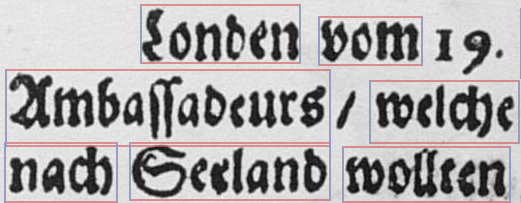
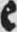
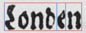

# Notice

Changes in LÖVE 11.0 made the current code incompatible. I'm looking into updating the code to run with the current version of LÖVE, but for the time being you would need to use LÖVE 0.9.2 to run the program: https://bitbucket.org/rude/love/downloads/

# greedy-ocr

`greedy-ocr`  is a *document-specific* OCR engine that works by looking for *prototype* letters on a given document. Consider the following document (just an extract, not a full page):

Every letter in this document has been printed using the same *type* (most of the time). If we tell the OCR system that an `e` looks like this:

Then it can find this `e` in a word by looking for the position of the closest, graphical similarity:

The difference to existing OCR engines is that the *character model* is **not** obtained by training on a large set of training images, but by using the character images found on the document itself (hence, *document-specific*).

Compare this to existing OCR engines, whose character model was created by training over thousands of images, hoping that the shape of the training images will be similar to the document to be recognized. This may work if the character model already saw billion shapes of the letter `e`, but as soon as a font differs from the training set---perhaps because some letters are written in a new style---these letters will be difficult to locate in the training set.

The recognition process basically comes down to the following assumptions:

*   Each letter is written similarly in a printed book.
*   By knowing the shape of some letters, they can be re-located in unknown pages.
*   By recognizing the shape of already-known characters, the shape of unknown characters can be deduced (see **Methods** below).

This system is based on the algorithms that appear in these two papers:

1.  Tao Hong and Jonathan J. Hull, ["Character Segmentation Using Visual Inter-word Constraints in a Text Page"](http://citeseerx.ist.psu.edu/viewdoc/download?doi=10.1.1.55.7481&rep=rep1&type=pdf)
2.  Andrew Kae et al., ["Learning on the fly: a font-free approach toward multilingual OCR"](http://link.springer.com/article/10.1007%2Fs10032-011-0164-6)

## About this project 

This project is part of my Bachelor's thesis at the Institute for Computational Linguistics at Heidelberg University in Germany. The main goal was to improve the character recognition of German *Fraktur*, especially for *Early New High German* (Frühneuhochdeutsch) texts.

Since my Bachelor's thesis is finished, I halted development on the `0.1` branch to mirror the development status during my thesis. This way, you should be able to reproduce the experiments described in my thesis.

# Methods

## Recognizing characters

Letters are recognized by comparing their visual similarity according to this formula:

                  Σi Σj (Aij && Bij)
        r(A, B) = -------------------
                  Σi Σj (Aij || Bij)
        Legend:
              i := image width
              j := image height
             Σi := loop from 0 to i
            Aij := the color of the pixel at the position (i|j)
             && := logical AND
             || := logical OR

For large word images, a prototype letter is being found by *sliding* the image along the x and y axis. This results in a point P where the prototype image is the most similar to the word image.

## Obtaining new character shapes

You don't need a prototype image for each character---`greedy-ocr` can obtain prototype images itself using a lexicon. The process works like this:

*   Let's say there are prototype images for the letters `o`, `n` and `d`, and the word to be recognized is `London`.
*   After every prototype has been found, the segment representing `London` looks like this: `?ondon`.
*   This "word" will get searched for inside a lexicon, and the only matching word is `London`.
*   `greedy-ocr` will then know that the originally unknown `?` must be an `L`, and thereby knows how an `L` looks like.
*   This image of an `L` is a new prototype that can be searched for in other words.

# Getting started

You will need the [LÖVE framework](https://love2d.org/) to be able to run `greedy-ocr`. Binaries for Windows and OS X are available from the website. For Linux, it's best to install LÖVE using your distribution's package manager.

If you want to run the same recognition process that I used in my Bachelor's thesis, download the `0.1` release from the [Releases](https://github.com/Eroica/greedy-ocr/releases) page (a `.love` file) and run that file:

		/path/to/love greedy-ocr.love

For instance on OS X, if you moved *love.app* to /Applications:

		/Applications/love.app/Contents/MacOS/love greedy-ocr.love

If you want to run an own recognition process, clone/download this repository and read the following instructions.

## Setup

As described earlier, `greedy-ocr` is a document-specific OCR engine. This means you will first need to set up some *Prototypes* for the document you want to recognize. A *Prototype* is, in general, a picture of a letter (or several letters) of which the system knows which character(s) it contains.

Every file or folder that starts with an underscore (`_`) will need some tweaking to fit your own document:

*   Prototypes are placed into the `_prototypes` directory.
*   Inside the `_pages` directory, place the image of the document to be recognized, along with a `.lua` file **of the same name** (only the name, not the extension). This `.lua` file contains the bounding boxes of every word in that document.
*   The `_share` folder contains some additional language data that the `greedy-ocr` system can utilize.
*   The `_config.lua` is used to configure the recognition process.

### Why bounding boxes?

The reason why `_pages` needs a file that describes every word's bounding box is because the segmentation of words is a non-trivial task for an OCR engine. Big OCR programs like *tesseract* already utilize powerful layout-analysis algorithms to find separate words, letters and symbols, but the algorithm described by `greedy-ocr` is more concerned about the recognition of words and not about segmentation (though segmentation into individual letters is part of `greedy-ocr`'s process).

Here is an example of a `.lua` file describing bounding boxes:

        return {{155, 17, 159, 58},
        {333, 29, 103, 48},
        -- {447, 38, 59, 52},
        {535, 21, 122, 69},
        {669, 25, 37, 58},
        {736, 35, 33, 48},
        {847, 30, 97, 66},
        {947, 38, 148, 67},
        {20, 82, 324, 76},
        {384, 93, 149, 62},
        }

*   The file begins with a `return {` and ends with a `}`
*   Inside this outer pair of `{}`, put another pair of `{}` describing a word's bounding box using the following format: `{top, left, width, height}`
*   By writing each bounding box on a separate line, it's easy to edit/delete a bounding boxes depending on the word order of the document (e.g. to change word #5's bounding box, edit the code on line #5).
*   A `--` begins a comment in Lua, so word #3 is currently disabled (useful for debugging).
*   The last comma is optional.

**Important:** Although support for recognition of several pages simultaneously is already in the code, right now it's best to put only one document in `_pages`.

### Prototypes

For every Prototype letter, set up a folder of that letter inside `prototypes/`, and move any amount of images of that letter into this new folder. Each image file inside this folder gets parsed automatically by `greedy-ocr`.

Since most file systems are case-insensitive, you cannot put an `E/` folder along with an `e/` inside `_prototypes`. This is one situation where you need to use the `_config.lua` file to set up Prototypes (see below).

#### Isn't taking characters from the page you want to recognize like cheating?

`greedy-ocr` is just an implementation of an algorithm---an algorithm that describes the recognition of words using a list of prototypes. Where these prototype images come from, depends on the use case. Consider the following scenario:

*   A book of 100 pages written in Fraktur needs to be recognized.
*   You extract some characters from page #1.
*   Using these Prototypes, you recognize page #1 and every subsequent page.

Without document-specific images, you would have to

*   create lots of training images and annotate their ground truth,
*   train the character model on these images,
*   run the recognition for the first time,
*   correct the errors,
*   re-train, and so forth.

For my Bachelor's thesis, for instance, I took Prototypes from page #266 to #269 of [this book](http://brema.suub.uni-bremen.de/zeitungen17/periodical/thumbview/992516) and recognized a part of page #270.

### Configuration

Take a look at the `_config.lua` file to tweak the parameters of the recognition, and setup other Prototypes that cannot be set up by putting them inside the `_prototypes/` directory.

## Starting & Recognizing

If everythig is set up correctly, you can start this program by running `love [this-folder]` from the command-line.

*   You can move around the document by holding `Space` and left-clicking with the mouse.
*   For a list of all Prototypes and cluster images available, press `P` on the keyboard.
    *   To see the binary images of these Prototypes, press `X`.
*   Right-click on a Segment to attempt to recognize it.
    *   IMPORTANT: This currently blocks the drawing thread, and the program will seem as if it was not responding. Depending on the size of the Segment, this process may take a long time (i.e. several minutes)!

# License
The original code in this repository is licensed under the **zlib** license. Code from 3rd-party libraries and the LÖVE framework are copyrighted by their respective authors.

When I used code snippets from other sites, I tried my best to find the original source, and linked to it (specified in the comments above the code). No copyright theft was intended.

## 3rd-party libraries

**greedy-ocr** uses the following 3rd-party libraries (located in `lib/`):

*   `30log` by [Roland Yonaba](https://github.com/Yonaba/30log) (License: MIT)
*   `inspect` by [Enrique García Cota](https://github.com/kikito/inspect.lua) (License: MIT)
*   `gamera` by [Enrique García Cota](https://github.com/kikito/gamera) (License: MIT)
*   `lovebird` by [rxi](https://github.com/rxi/lovebird) (License: MIT)
*   `lurker` and `lume` by [rxi](https://github.com/rxi/lurker) (License: MIT)
*   `tiny-ecs` by [Calvin Rose](https://github.com/bakpakin/tiny-ecs) (License: MIT)

The file `gr_mercurius.lua` depends on the following library:

*   `xml` by [lubyk](http://doc.lubyk.org/xml.html) (License: MIT)
